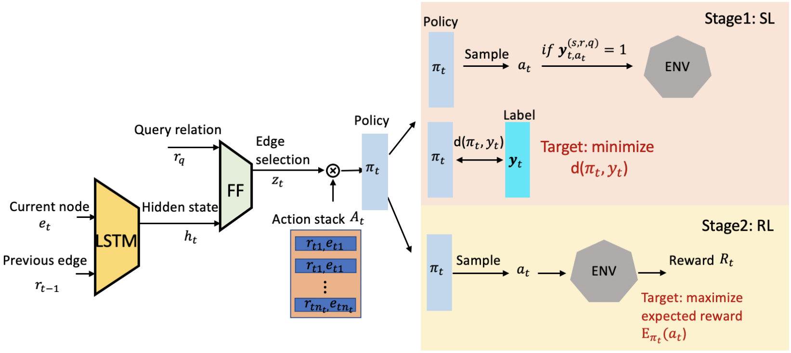

# Knowledge Graph Reasoning with Self-supervised Reinforcement Learning
Official code for the following paper:

PLACEHOLDER



## Setup
### Dependencies
#### Use Docker
Build the docker image
```
docker build -< Dockerfile -t kg_ssrl:v1.0
```

Spin up a docker container and run experiments inside it.
```
nvidia-docker run -v `pwd`:/workspace/KGSSRL -it kg_ssrl:v1.0
```
*The rest of the readme assumes that one works interactively inside a container. If you prefer to run experiments outside a container, please change the commands accordingly.*

#### Manually set up 
Alternatively, you can install Pytorch (>=1.12.0+cu116) manually and use the Makefile to set up the rest of the dependencies. 
```
make setup
```

### Prepare and run experiments
#### Set up an experiment
Run the following command to set up an experiment
```
./experiment_setup.sh <rl Base Model> <dataset> <gpu-ID>
```
The following rl base models are implemented: `MINERVA`, and `MultiHopKG-ConvE`.
The following datasets are available: `FB15K-237`, `FB60K-NYT10` (only available for `MINERVA` base model), `NELL-995`, and `WN18RR`.
`<gpu-ID>` is a non-negative integer number representing the GPU index.

* Note: Setup will take a while for any experiment using `MultiHopKG-ConvE` as the RL base model as a standalone ConvE model must be trained to be used for reward shaping.

#### Run an experiment
Run the following command to train a model
```
./experiment_run.sh <rl Base Model> <dataset> <gpu-ID> <experiment_name>
```
experiment_name will be used to name the experiment's output folder, which will be located in the out/ directory. The structure of the output directory is as follows
```
<rl Base Model>
    └── <dataset>
            └── <experiment_name>_<current_time>
                    ├── config.txt
                    ├── log.txt
                    ├── model
                    │       └── <saved model files>
                    ├── checkpoint_sl_<ckpt_#>
                    │       ├── model_weights
                    |       |       └── <saved model files>
                    │       └── scores.txt
                    └── checkpoint_sl_<ckpt_#+1>
                    etc.
```

#### Process Data
To generate heatmaps and training graphs for an experiment, run the following command
```
./process_experiment.sh <rl Base Model> <dataset> <experiment_name>_<current_time> <moving average window>
```
The heatmap and training graphs will appear in ```<rl Base Model>/<dataset>/<experiment_name>_<current_time>/``` as ```heatmap.png``` and ```training_curves.png``` respectively.

## Citation
If you use this code, please cite our paper and those referenced for the base models
```
@inproceedings{minerva,
  title = {Go for a Walk and Arrive at the Answer: Reasoning Over Paths in Knowledge Bases using Reinforcement Learning},
  author = {Das, Rajarshi and Dhuliawala, Shehzaad and Zaheer, Manzil and Vilnis, Luke and Durugkar, Ishan and Krishnamurthy, Akshay and Smola, Alex and McCallum, Andrew},
  booktitle = {ICLR},
  year = 2018
}
@inproceedings{LinRX2018:MultiHopKG, 
  author = {Xi Victoria Lin and Richard Socher and Caiming Xiong}, 
  title = {Multi-Hop Knowledge Graph Reasoning with Reward Shaping}, 
  booktitle = {Proceedings of the 2018 Conference on Empirical Methods in Natural
               Language Processing, {EMNLP} 2018, Brussels, Belgium, October
               31-November 4, 2018},
  year = {2018} 
}
@inproceedings{kgr-ssrl,
  title = {Knowledge Graph Reasoning with Self-supervised Reinforcement Learning},
  author = {Ying Ma, Owen Burns, Mingqiu Wang, Gang Li, Nan Du, Laurent Shafey, Izhak Shafran, Hagen Soltau},
  booktitle = {AAAI},
  year = 2022
}
```